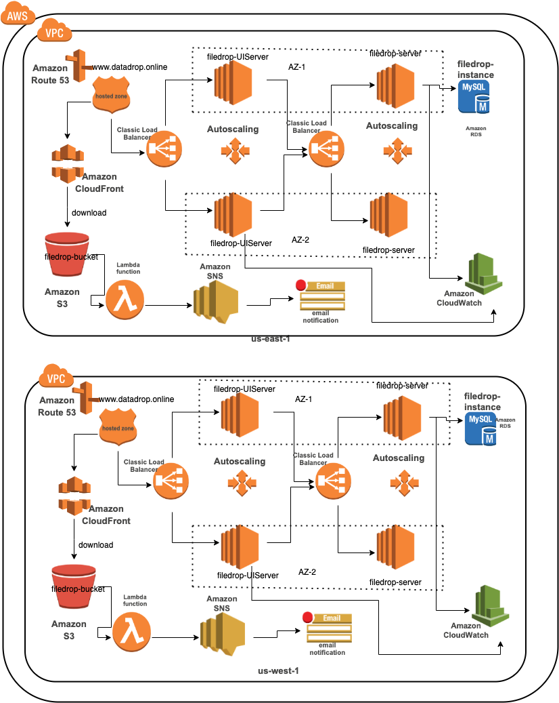

# Filedrop
Project site: www.datadrop.online

The web application has the following functionality for authorized users:
1) Sign Up: On Sign Up, an SNS notification subscription is created for the user in the SNS topic. Users have to subscribe to those notifications from the email sent to their email id used during signup.
   If email is not found in the inbox, it will present in the spam folder.
2) Login:
    
3) Upload Files:Files with max size upto 10MB can be uploaded. A small file description can also be added.
   
4) Delete Files
5) Download Files
The files can be downloaded by clicking on the download button. For the download functionality CloudFront links are leveraged
5Update Files: In case of update a new file and description can be chosen and the same record is updated in the database table. The old file is deleted and the new file is uploaded.
6) Admin View:
The admin can view the files uploaded by all users and can also delete those files

# Architecture:
